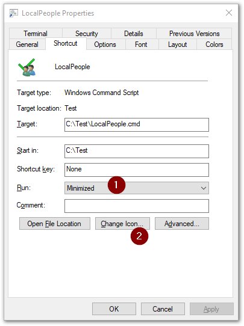

# PoshCSVEdit deployment idea

If you're planning to let non-technical end-users use [PoshCSVEdit](https://github.com/ProjectThySoul/PoshCSVEdit), you probably don't want to have to tell them to open to a [PowerShell](https://en.wikipedia.org/wiki/PowerShell) terminal and enter the commands to launch it manually.

Here's an idea on how to make this a more user-friendly experience for them.

## Use a batch file and a shortcut

Create a [batch file](https://en.wikipedia.org/wiki/Batch_file) (`.bat`, or `.cmd`) which launches PoshCSVEdit with the relevant parameters for your `.csv` file e.g. -

```batch
@ECHO OFF
START /MIN PowerShell.exe -NoProfile -ExecutionPolicy Bypass -File "C:\Test\PoshCSVEdit\PoshCSVEdit.ps1" -CSVPath "C:\Test\PoshCSVEdit\Example.csv" -SchemaPath "C:\Test\PoshCSVEdit\Example.json" -ShowLockFile
```

> ℹ In the above, `@ECHO OFF` hides the text from the terminal, and `START /MIN` launches the PowerShell console window minimised.

Create a [shortcut](https://en.wikipedia.org/wiki/Shortcut_(computing)) to the batch file. Set the **Run** box (1) to `Minimized` so that the [command prompt](https://en.wikipedia.org/wiki/Cmd.exe) window doesn't show on-screen. You can also set a nice icon if you like (2).



When an end-user opens the shortcut, they might see a command prompt or PowerShell icon flash in the [taskbar](https://en.wikipedia.org/wiki/Taskbar#Microsoft_Windows) briefly, but then PoshCSVEdit will open using the specified `.csv` file with the specified schema.
