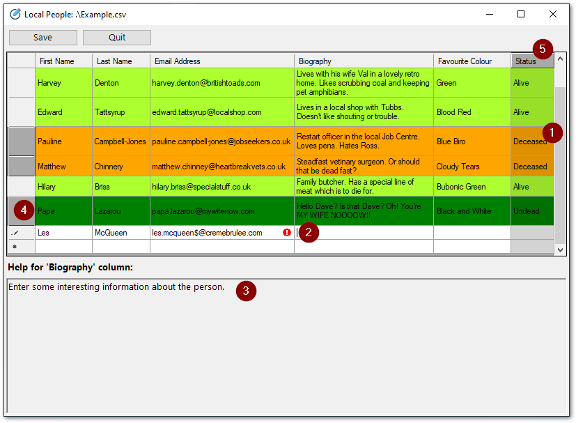

# PoshCSVEdit

A simple [PowerShell](https://en.wikipedia.org/wiki/PowerShell) [CSV](https://en.wikipedia.org/wiki/Comma-separated_values) file editor leveraging the [Windows Forms](https://docs.microsoft.com/en-us/dotnet/framework/winforms/) [DataGridView Class](https://docs.microsoft.com/en-us/dotnet/api/system.windows.forms.datagridview?view=windowsdesktop-6.0).

## Introduction

I wanted a solution to allow non-technical users to add data to a `.csv` file which could subsequently be processed by a PowerShell script and return results into different columns to those used for input.

Whilst in theory this can easily be handled by editing the `.csv` file in [Microsoft Excel](https://en.wikipedia.org/wiki/Microsoft_Excel) ([other spreadsheet software](https://en.wikipedia.org/wiki/Spreadsheet#Other_spreadsheets) is available), in practice this results in a cornucopia of input errors such as - 

- People guessing what information should go in which column.

- People mistyping information, mangling email address formatting etc.

- People entering information into columns which were intended to be read-only.

After seeing what [Out-GridView](https://docs.microsoft.com/en-us/powershell/module/microsoft.powershell.utility/out-gridview?view=powershell-5.1) PowerShell cmdlet could do, I wanted something similar which would allow editing of `.csv` data whilst also providing some basic data validation.

## Solution

The chosen solution was to build a Windows Form using PowerShell, and to use a DataGridView control to allow editing of the `.csv` data. This provides functionality to - 

1. **Change the colour of a row based on the value in a column.**
   This can be used to easily indicate problems with the row, or to display different colours for different categories of things etc.

2. **Configure validation formulae for columns**
   This guides end-users into entering the correct information into each column as validation must be passed before the row can be committed.

3. **Display help for the selected column**
   In combination with the validation formulae, this is intended to provide clarity as to what data is expected in the column and thus (hopefully) reduce the incidence of input errors.

4. **Allow rows to be made read-only based on a value in one of the columns**
   This can be useful if you'd like to block further input to a row e.g. after a column has been stamped with `Complete` or `Processed` etc.

5. **Allow columns to be set to read-only**
   If you're processing the `.csv` with a script, you might want to make the columns which are returned by the script read-only so that an end-user doesn't inadvertently add data to them.

<p align="center">
  
</p>

In order to make the script re-usable for many different `.csv` files, the configuration for each type of `.csv` file is stored in a separate [schema](#Schema) file.

## Script

### Syntax

```powershell
PoshCSVEdit.ps1
[-CSVPath <String>]
[-SchemaPath <String>]
[-ShowLockFile <Switch>]
[-HideConsole <Switch>]
```

### Example

The following opens `C:\Test\Example.csv` using the schema `C:\Test\Example.json` and displays a lock file in the same path as `C:\Test\Example.csv`.

```powershell
.\PoshCSVEdit.ps1 -CSVPath "C:\Test\Example.csv" -SchemaPath "C:\Test\Example.json" -ShowLockFile
```

### Parameters

- `-CSVPath`
  
  - The path of the `.csv` file to open with **PoshCSVEdit**.
  
  - Type: `String`.

- `-SchemaPath`
  
  - The path of the `.json` schema for the `.csv` file.
  
  - Type: `String`. 

- `-ShowLockfile`
  
  - Specify this switch if you'd like to place a lock file in the same folder as the `.csv` file, indicating that the file is locked (and who by).
  
  - Type: `Switch`.
  
  - **Note:** The `.csv` file will be locked whilst the script is running regardless of whether or not you specify this switch. This is to provide an easy indicator to the end-user that the file is in use.

- `-HideConsole`
  
  - Specify this switch if you want to hide the PowerShell console window whilst the form is showing.
  
  - Type: `Switch`.

## Schema

The schema is in [JSON](https://www.json.org/json-en.html) format, and requires at a minimum a definition for each column in the `.csv` file.

Optionally, you can specify the `FormTitle`, which is what will be displayed at the top of the Windows Form.

Please see [Example.json](Example.json) for a better idea of how this works.

### Schema basic layout

```json
{
    "FormTitle" : "The form title",
    "Columns": [{
        "Name of Column 1": {
            "Type": "TextBox"
        },
        "Name of Column 2": {
            "Type": "ComboBox"
        },
        "Etc ..."
}
```

### Schema 'Columns' options

> ℹ The minimal configuration for a column is its name (specified as the key name) and `Type`.

- `ColumnReadOnly`
  
  - Boolean (`true` or `false`) specifying whether this column should be read only.

- `Type`
  
  - A string value denoting whether this column is either a `TextBox` or a `ComboBox`.

- `AllowBlank`
  
  - Boolean (`true` or `false`) specifying whether this column will allow blanks.
  
  - If you specify false, a validation error will be entered if the user leaves a cell in this column blank.

- `ComboBoxOptions`
  
  - Used only in conjunction with `Type` = `ComboBox`.
  
  - An array of values denoting which options should be available to select in the ComboBox.

- `RowReadOnlyIfValue`
  
  - A string specifying a value. If the cell contains this value, then the entire row in the DataGridView will be made read-only.

- `RowColourIfValue`
  
  - A collection of key / value pairs. The key indicates the value of the cell, the value indicates which colour to turn the row if the cell contains the value specified in the key.
  
  - You can specify multiple key / value pairs to account for different expected values in the column.
  
  - Please use named [.Net colors](https://docs.microsoft.com/en-us/dotnet/api/system.windows.media.colors?view=windowsdesktop-6.0).

- `Wrap`
  
  - Boolean (`true` or `false`) specifying whether or not the text in this column should be wrapped.

- `ValidationRegEx`
  
  - A regular expression which the value in the cell must match in order to pass validation.
  
  - If the cell does not pass the validation specified in the `ValidationRegEx`, a validation error will be raised for the cell.

- `Transform`
  
  - A text transformation to apply to the text in this column.
  
  - Available options are -
    
    - `Upper`
    
    - `Lower`
    
    - `Title`

- `HelpText`
  
  - The text to display in the Column Help box for this column.
  
  - You can use forum-style tags to format the text by enclosing the text in the following tags -
    
    - [b]**Bold**[/b]
    
    - [i]*Italic*[/i]
    
    - [u]<u>Underline</u>[/u]
    
    - [s]S~~trikethrough~~[/s]
    
    - **Note:** Nested tags are *not* currently supported (e.g. [b][i]Potato[/b][/i]).

- `ToolTipText`
  
  - The [Tooltip](https://en.wikipedia.org/wiki/Tooltip) to display for this column.
  
  - This may or may not be different to the `HelpText`, but ToolTips do not support Rich Text formatting, so bear that in mind!

- `ErrorText`
  
  - The error to display for a column if it does not pass validation.
  
  - Validation consists of checking for blanks with `AllowBlank` and / or the `ValidationRegEx`.

## Deployment

If you're planning to deploy this tool to end-users, here are some [deployment ideas](Docs/DeploymentIdeas.md).

## Future development plans

- Allow usage *without* a schema.

- Validation improvements.
  
  - The option to validate *all* editable rows on save or quit.
  
  - The ability to validate columns based on the value in another.

- ComboBox column improvements.
  
  - Allow sorting by clicking ComboBox column headers.
  
  - Allow entry of *new* values into a ComboBox (i.e. one not defined in `ComboBoxOptions` in the schema).

- RichTextBox (Column Help) improvements.
  
  - Allow mutiple font transformations to be applied to the same RichTextBox selection.
  
  - Allow arbitrary text in hyperlinks in RichTextBox.
  
  - Track why rows / cells are read-only and display the reason in the Column Help box.
